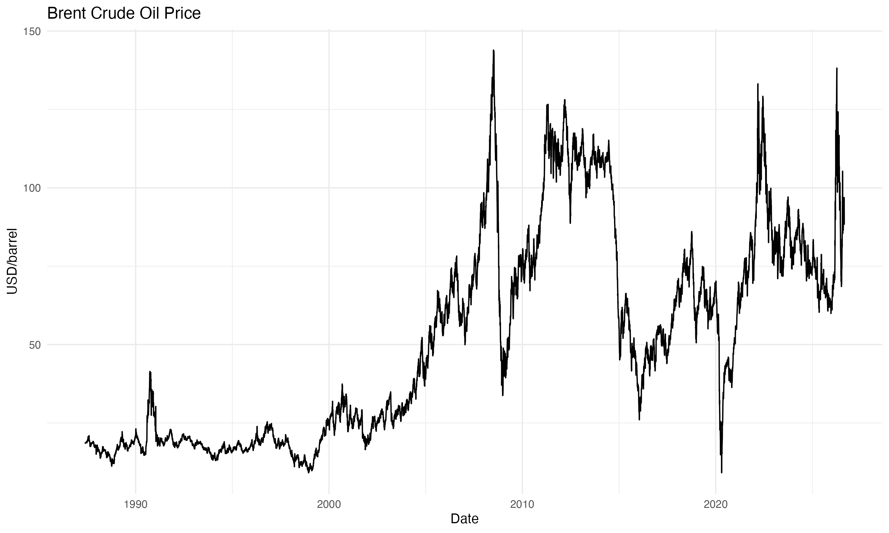
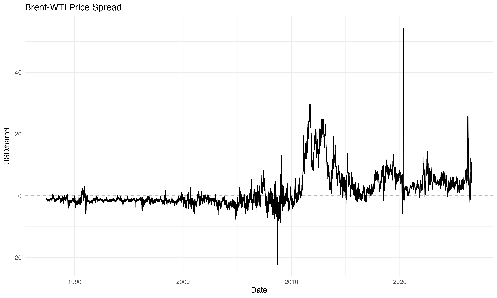
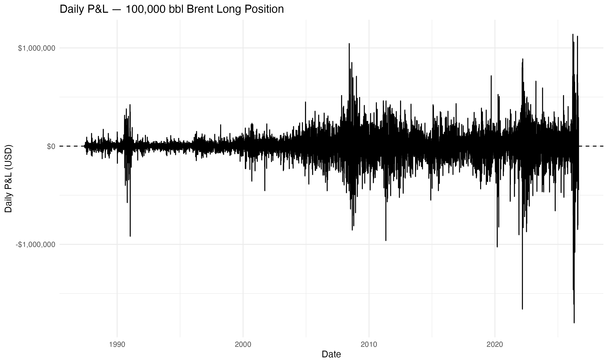
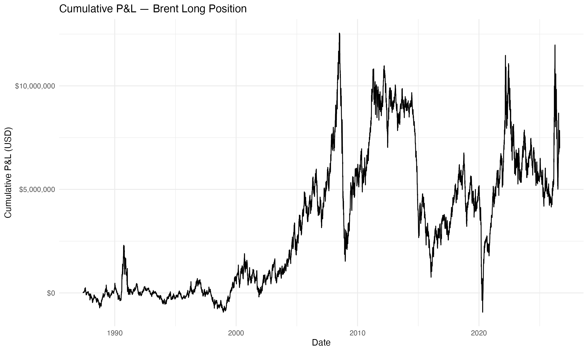
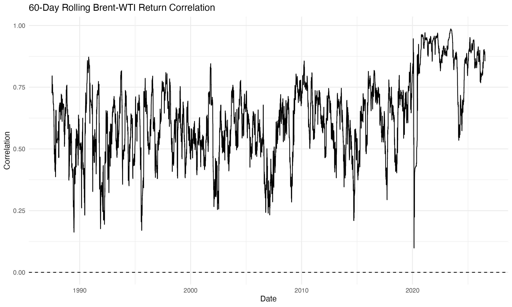
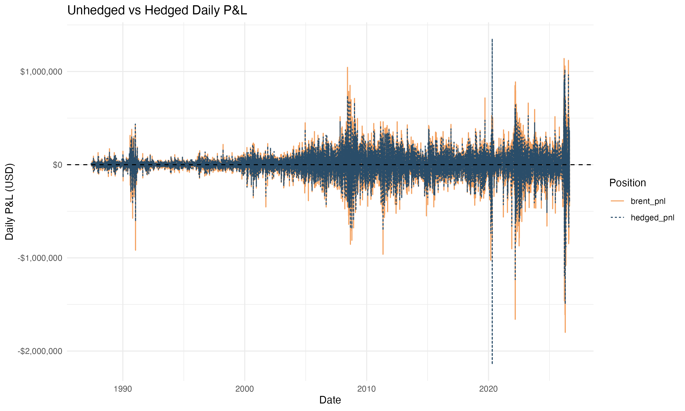
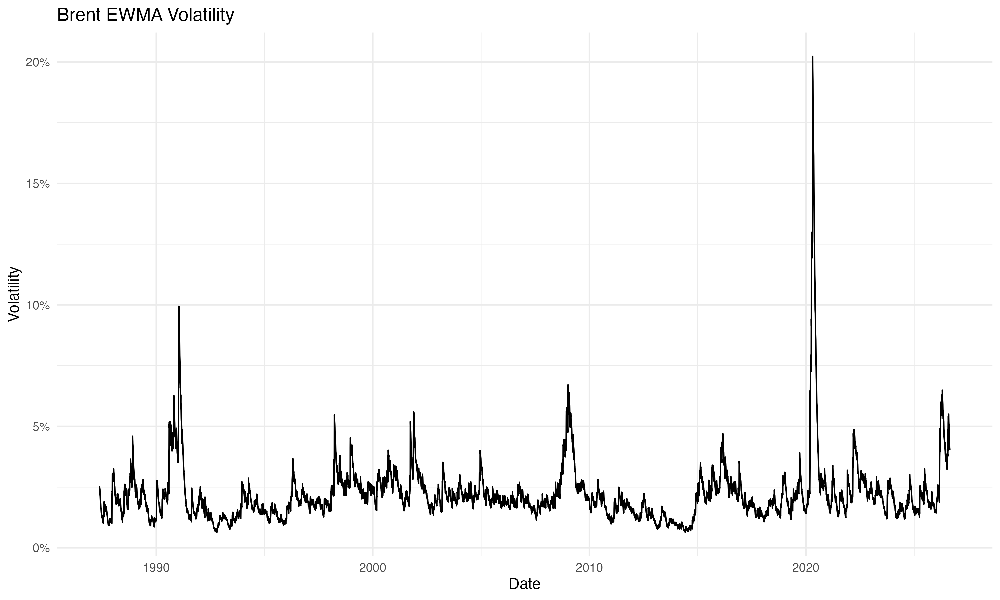
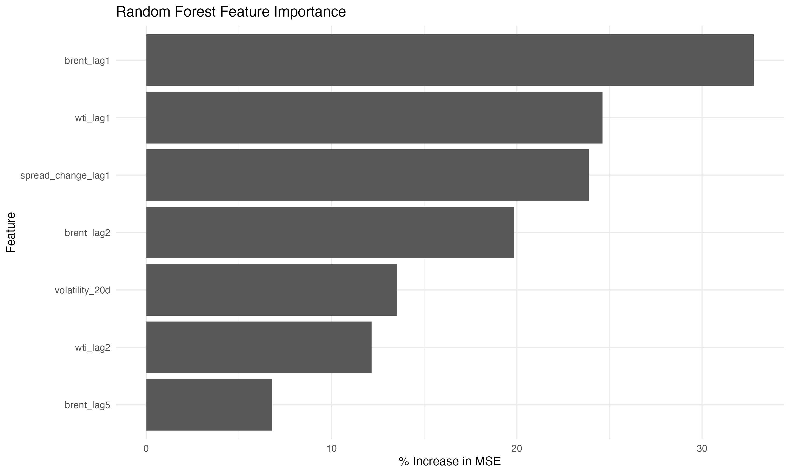

```{r setup, include=FALSE}
knitr::opts_chunk$set(
  echo = FALSE,
  warning = FALSE,
  message = FALSE,
  fig.align = "center",
  out.width = "95%"
)

library(knitr)
library(dplyr)
library(readr)
library(scales)

risk_summary <- read_csv("results/risk_summary.csv", show_col_types = FALSE)
stress <- read_csv("results/stress.csv", show_col_types = FALSE)
ml_results <- read_csv("results/ml_model_comparison.csv", show_col_types = FALSE)

risk_value <- function(metric) {
  risk_summary$Value[risk_summary$Metric == metric][1]
}
```

# Executive Summary

This project applies practical market and risk analytics to **Brent crude oil**, using **WTI crude oil as a related hedge instrument**.

The analysis follows a commodity-risk workflow:

**Market data → market relationship → position P&L → hedging → VaR → stress testing → volatility monitoring → model evaluation**

The project uses daily Brent and WTI price data from the **Federal Reserve Bank of St. Louis FRED**, with the Brent series `DCOILBRENTEU` and WTI series `DCOILWTICO`.

## Key Results

| Metric | Result |
|:--|--:|
| Illustrative Brent position | 100,000 bbl |
| WTI hedge position | `r comma(round(risk_value("WTI Hedge Position")))` bbl |
| Brent–WTI return correlation | 0.482 |
| Regression-based hedge ratio | 0.288 |
| Unhedged daily volatility | `r percent(risk_value("Unhedged Daily Volatility"), accuracy = 0.01)` |
| Hedged daily volatility | `r percent(risk_value("Hedged Daily Volatility"), accuracy = 0.01)` |
| Unhedged 95% historical VaR | `r dollar(risk_value("Unhedged 95% VaR"), accuracy = 1)` |
| Hedged 95% historical VaR | `r dollar(risk_value("Hedged 95% VaR"), accuracy = 1)` |
| VaR reduction | `r percent(risk_value("VaR Reduction"), accuracy = 0.1)` |

> **Main takeaway:** In this illustrative setup, the WTI hedge reduced measured daily volatility and historical 95% VaR, while leaving residual basis risk between Brent and WTI.

# 1. Market Data & Preparation

The project uses two publicly available daily crude-oil price series:

- **Brent crude oil:** FRED `DCOILBRENTEU`
- **WTI crude oil:** FRED `DCOILWTICO`

The raw series are converted to dates, missing observations are removed, and the two markets are merged by date.

The analysis then derives:

- Brent–WTI price spread
- Brent daily returns
- WTI daily returns
- Daily changes in the Brent–WTI spread

This provides the market-data foundation for the subsequent P&L, hedging and risk analysis.

# 2. Brent Market Analysis

## Brent Crude Oil Price

The long-run Brent price series provides context for the market environment represented in the dataset.



## Brent–WTI Price Spread

The spread is defined as:

$$
Spread_t = Brent_t - WTI_t
$$

A changing spread highlights that Brent and WTI are related markets but are **not identical exposures**.



# 3. Position & Daily P&L

To translate market movements into a trading-risk context, the project assumes an **illustrative 100,000 barrel long Brent position**.

Daily P&L is calculated from the daily change in Brent price:

$$
P\&L_t = Position \times (Brent_t-Brent_{t-1})
$$

This is an illustrative risk-analysis position rather than a record of an actual trade.

## Daily P&L



## Cumulative P&L



The purpose of the P&L analysis is to connect a market-price series to a position-level financial impact, which is a core concept in commodity trading and risk monitoring.

# 4. Brent–WTI Hedging Analysis

## Return Correlation

The overall correlation between Brent and WTI daily returns is approximately **0.482** in this analysis.

The relationship is not constant over time, so a 60-day rolling correlation is also calculated.



The rolling correlation has a mean of approximately **0.627**, indicating that the two markets often move together, but the strength of the relationship varies materially across periods.

## Regression-Based Hedge Ratio

The project estimates:

$$
BrentReturn_t = \alpha + \beta WTIReturn_t + \epsilon_t
$$

The estimated coefficient is:

$$
\hat{\beta} \approx 0.288
$$

This coefficient is used here as an **illustrative regression-based hedge ratio**.

In practical terms, the analysis asks:

> How much WTI exposure could be used to offset part of the price risk of a Brent position?

The resulting illustrative hedge position is approximately **28,794 barrels of short WTI** against the 100,000 barrel Brent position.

The hedge should not be interpreted as eliminating all risk: Brent and WTI have different physical and market characteristics, so **basis risk remains**.

## Hedged vs. Unhedged Volatility

The calculated daily volatility falls from approximately

**2.54% → 2.23%**

after applying the illustrative hedge ratio.



This provides a simple example of how a related commodity can be used to reduce, rather than completely eliminate, market exposure.

# 5. VaR & Stress Testing

## Historical 95% VaR

The project calculates one-day historical 95% VaR from the empirical P&L distribution:

$$
VaR_{95} = -Q_{0.05}(P\&L)
$$

In this implementation, the historical 95% VaR represents a loss threshold based on the 5th percentile of the observed P&L distribution.

It is **not** a maximum-loss estimate and should not be interpreted as a guarantee about future losses.

### Risk Impact of Hedging

The illustrative hedge changes the measured VaR from:

**Unhedged: `r dollar(risk_value("Unhedged 95% VaR"), accuracy = 1)`**

to

**Hedged: `r dollar(risk_value("Hedged 95% VaR"), accuracy = 1)`**

representing a reduction of approximately **17.1%** in this historical VaR measure.



## Stress Testing

The project also tests several simple price shocks:

```{r stress-table}
stress_display <- stress %>%
  transmute(
    Scenario = scenario,
    `Brent Change` = percent(brent_change, accuracy = 1),
    `WTI Change` = percent(wti_change, accuracy = 1),
    `Brent P&L` = dollar(brent_pnl, accuracy = 1),
    `WTI Hedge P&L` = dollar(wti_pnl, accuracy = 1),
    `Combined P&L` = dollar(hedged_pnl, accuracy = 1)
  )

kable(stress_display, align = "lrrrrr")
```

The combined **Brent -20% / WTI -15%** scenario produces an illustrative hedged P&L of approximately **-$1.40 million**, compared with **-$1.76 million** on the Brent position before the WTI hedge contribution.

This demonstrates an important risk-management point: a hedge can reduce the impact of a shock without necessarily eliminating the loss.

# 6. EWMA Volatility Monitoring

The project uses an EWMA volatility measure with:

$$
\sigma_t^2 =
\lambda\sigma_{t-1}^2+
(1-\lambda)r_{t-1}^2
$$

where the analysis uses:

$$
\lambda=0.94
$$

EWMA gives greater weight to more recent observations than an equally weighted long historical window.

The resulting volatility series has a median of approximately **1.97%** and a mean of approximately **2.20%** in the project dataset.


For a commodity-risk workflow, this can be used as a simple way of monitoring whether recent market conditions have become more volatile.

# 7. Machine Learning: Model Evaluation

A Random Forest model is included as a **secondary model-evaluation exercise**, rather than as the main trading signal.

Features include:

- Lagged Brent returns
- Lagged WTI returns
- Lagged Brent–WTI spread changes
- 20-day Brent volatility

The model uses a chronological **80% training / 20% test split** to avoid randomly mixing future observations into the training set.

## Out-of-Sample Results

```{r ml-table}
ml_display <- ml_results %>%
  mutate(
    RMSE = round(RMSE, 5),
    Directional_Accuracy = ifelse(
      is.na(Directional_Accuracy),
      NA,
      percent(Directional_Accuracy, accuracy = 0.1)
    )
  )

kable(ml_display, align = "lrr")
```

The Random Forest RMSE is approximately **0.03431**, compared with **0.03382** for the naive zero-return benchmark.

Therefore, the Random Forest **did not outperform the simple benchmark in out-of-sample RMSE**.

This is an important result rather than a failure of the project: it shows that a more complex model does not automatically provide better predictive performance.



The feature-importance results are useful for exploring which market variables the model relied on, but they are not interpreted as causal effects.

# 8. Methodology at a Glance

| Component | Method | Purpose |
|:--|:--|:--|
| Market analysis | Price spread & returns | Understand related crude markets |
| P&L | Position × price change | Translate market moves into financial impact |
| Hedging | Return regression | Estimate an illustrative hedge ratio |
| Risk | Historical 95% VaR | Quantify downside risk from observed P&L |
| Stress testing | Scenario shocks | Examine losses under large market moves |
| Volatility | EWMA | Monitor changing market volatility |
| Prediction | Random Forest | Test whether nonlinear features improve forecasting |

# 9. Key Takeaways

1. **Brent and WTI are related but imperfectly correlated markets.** The relationship varies over time, creating residual basis risk.
2. **A regression-based WTI hedge reduced measured volatility and historical VaR** in the illustrative Brent position.
3. **Stress testing complements VaR** by showing the potential impact of explicitly specified market shocks.
4. **EWMA provides a simple dynamic volatility measure** that gives more weight to recent observations.
5. **The Random Forest did not outperform the naive benchmark out of sample**, illustrating the importance of model validation rather than assuming that model complexity improves forecasting.

# 10. Technical Skills Demonstrated

**R:** tidyverse, data cleaning, visualization, regression, time-series calculations, Random Forest

**Econometrics & Modeling:** regression, return modeling, rolling correlation, EWMA volatility, time-series feature engineering

**Commodity & Risk Analysis:** commodity pricing, position P&L, hedging, VaR, stress testing, volatility monitoring

# Disclaimer

This is an **illustrative educational portfolio project** using publicly available market data. The assumed 100,000 bbl position and hedge are hypothetical. The analysis is intended to demonstrate market and risk-analytics methods rather than provide investment advice or represent actual trading activity.
